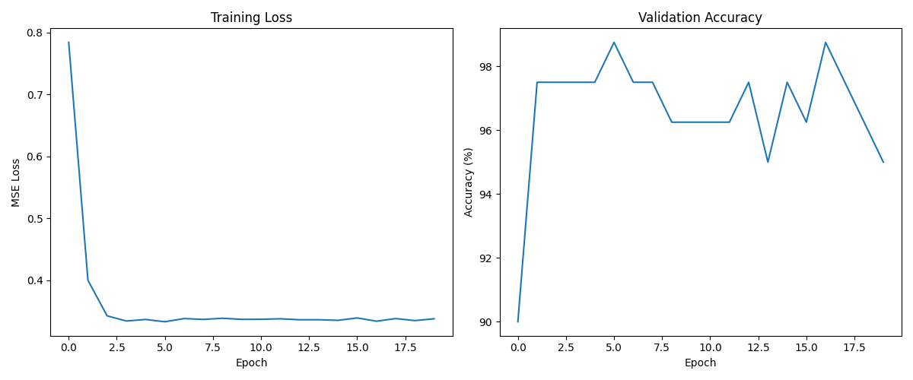

# Quantum Perceptron for MNIST Classification

This project implements a hybrid quantum-classical perceptron to classify handwritten digits (0s and 1s) from the famous MNIST dataset. It uses [PennyLane](https://pennylane.ai/) for the quantum circuit and a classical training loop written in Python.

This was a personal project built to gain hands-on experience with Quantum Machine Learning (QML) and understand how a variational quantum algorithm can be integrated into a familiar machine learning pipeline.



## How It Works

The model follows a hybrid quantum-classical approach:

1.  **Data Preprocessing**:
    * The MNIST dataset is loaded, and filtered to only include images of digits '0' and '1'.
    * Principal Component Analysis (PCA) is used to reduce the dimensionality of each image from 784 pixels down to 4 features. This makes the classical data manageable for a small number of qubits.
    * The data is normalized and prepared for encoding into the quantum circuit.

2.  **The Quantum Circuit**:
    * A 4-qubit quantum circuit is defined using PennyLane's `qml.qnode`.
    * **Encoding**: The 4 classical features from the data are encoded into the quantum state using `qml.AngleEmbedding`, which rotates each qubit based on a feature value.
    * **Variational Layer**: A trainable layer of `qml.BasicEntanglerLayers` acts as the core of the model. The `weights` of these layers are the parameters that the model learns during training, similar to the weights in a classical neural network.
    * **Measurement**: The expectation value of the `PauliZ` operator on the first qubit is measured. This gives a classical output between -1 and 1, which serves as the model's prediction.

3.  **The Hybrid Training Loop**:
    * The quantum circuit is treated as a function within a classical Python script.
    * The script calculates the Mean Squared Error (MSE) loss between the circuit's predictions and the true labels (-1 for '0', 1 for '1').
    * PennyLane's automatic differentiation capabilities (`qml.grad`) are used to compute the gradient of the loss with respect to the circuit's `weights`.
    * The `weights` are updated using a standard gradient descent step. This process is repeated over several epochs and batches until the model learns to classify the digits correctly.

## Technologies Used

* **Python 3.x**
* **PennyLane**: For quantum circuit simulation and differentiation.
* **NumPy**: For numerical operations.
* **Scikit-learn**: For PCA-based dimensionality reduction.
* **PyTorch**: For initial data loading from `torchvision`.
* **Matplotlib**: For plotting the training results.

## Setup and Installation

1.  **Clone the repository:**
    ```bash
    git clone [https://github.com/karanbhatia26/Quantum_Perceptron.git](https://github.com/karanbhatia26/Quantum_Perceptron.git)
    cd Quantum_Perceptron
    ```

2.  **Create a virtual environment (recommended):**
    ```bash
    python -m venv venv
    source venv/bin/activate  # On Windows, use `venv\Scripts\activate`
    ```

3.  **Install the required packages:**
    A `requirements.txt` file is included for convenience.
    ```bash
    pip install -r requirements.txt
    ```

## How to Run

To run the training script and see the results, simply execute the following command in your terminal:

```bash
python qper.py
```

## Sample Output

The script will print the training progress for each epoch and then display a plot of the training loss and validation accuracy.

```
Starting training...
Epoch  1 | Avg Loss: 0.7128 | Validation Accuracy: 97.50%
Epoch  2 | Avg Loss: 0.4569 | Validation Accuracy: 97.50%
Epoch  3 | Avg Loss: 0.3410 | Validation Accuracy: 97.50%
...
Epoch 18 | Avg Loss: 0.3361 | Validation Accuracy: 98.75%
Epoch 19 | Avg Loss: 0.3371 | Validation Accuracy: 97.50%
Epoch 20 | Avg Loss: 0.3363 | Validation Accuracy: 97.50%

Training complete.
```

## License

This project is licensed under the MIT License. See the `LICENSE` file for details.